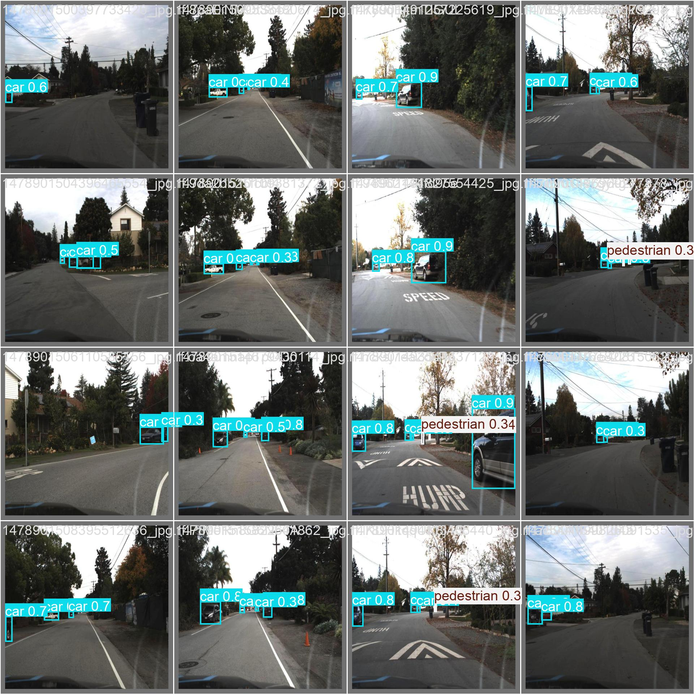
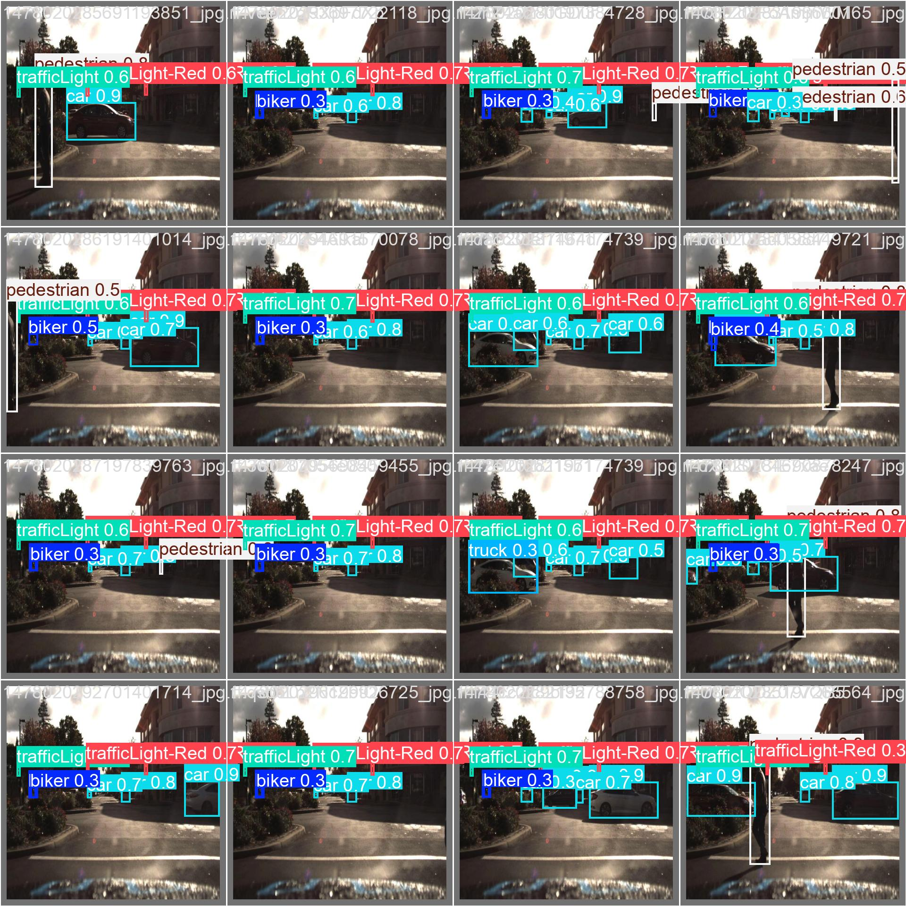
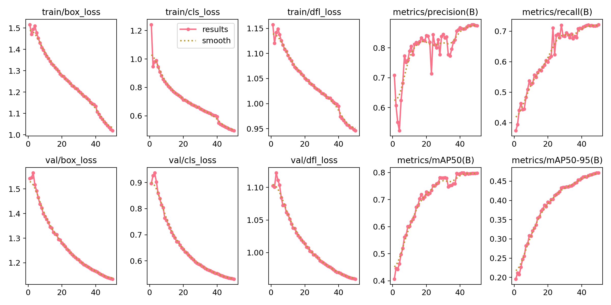
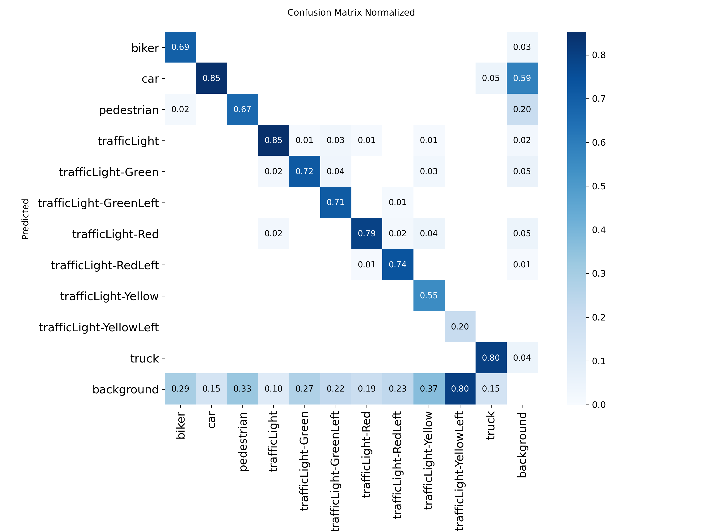

# Vehicle Warning System

An ML powered collision warning system for autonomous vehicles built using YOLOv8 and computer vision techniques.

## Project Overview

This project implements an end-to-end machine learning pipeline that detects objects in dashcam footage and provides directional collision warnings. The system identifies vehicles, pedestrians, cyclists, and more, then analyzes their positioning to determine potential threats from different directions.

## Demo Video

*[Add your demo video here showing the collision warning system in action]*

)

## Features

- **Multi-Object Detection**: Identifies cars, pedestrians, cyclists, trucks, and other traffic lights
- **Directional Warnings**: Provides warnings like "INCOMING FROM LEFT", "VEHICLE AHEAD", "COLLISION CRITICAL"
- **Threat Assessment**: Three-level warning system (LOW, MEDIUM, HIGH, CRITICAL) based on bounding box size tracker

## Model Performance

- **Accuracy**: 80% mAP@0.5 on Udacity self driving car dataset
- **Classes Detected**: 11 different object classes
- **Processing Speed**: Real-time inference with GPU acceleration

## Sample Results

### Model Detection in Action
*[Add screenshots of your model detecting objects in dashcam footage]*

### Training Results
*[Add your training validation plots and confusion matrix]*

*Training and validation loss curves*

*Model performance across different object classes*

## Technology Stack

- **Deep Learning**: YOLOv8 (Ultralytics)
- **Computer Vision**: OpenCV
- **Machine Learning**: PyTorch
- **Data Processing**: Pandas, NumPy
- **Development Environment**: Google Colab with GPU acceleration
- **Programming Language**: Python

## Dataset

- **Source**: Udacity Self-Driving Car Dataset
- **Format**: Images with bounding box annotations
- **Classes**: Cars, pedestrians, cyclists, trucks, and other road objects
- **Training Split**: 80% training, 20% validation

## How It Works

### 1. Object Detection
- Uses YOLOv8 to detect and classify objects in each frame
- Draws bounding boxes around detected objects
- Provides confidence scores for each detection

### 2. Collision Warning Logic
- Divides frame into zones (left, center, right)
- Analyzes object size and position
- Determines threat level based on proximity and direction
- Provides real-time warnings

### 3. Directional Assessment
- **Left Zone**: Objects in left third of frame
- **Right Zone**: Objects in right third of frame  
- **Front Zone**: Large objects in center/lower portion
- **Threat Levels**: Based on bounding box area relative to frame size

## Contributing

Feel free to open issues or submit pull requests if you have suggestions for improvements!

## License

This project is open source and available under the [MIT License](LICENSE).

## Acknowledgments

- Udacity for providing the self-driving car dataset
- Ultralytics for the YOLOv8 implementation
- The computer vision and autonomous vehicle communities for inspiration

---

**Note**: This is a learning project and not intended for production use in actual vehicles. Always prioritize safety and use proper automotive-grade systems for real-world applications.
